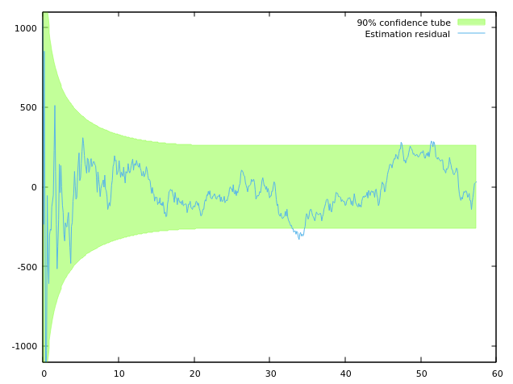
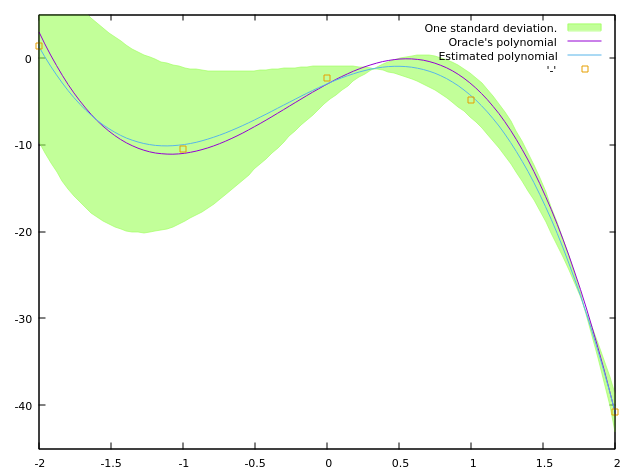

# `kalman-folding`
Playing with Kalman folding à la Brian Beckman [^kf-1] [^kf-2] [^kf-4].

***Warning:*** *this is a work in progress.*

***NB:*** I am extending this technique to control systems in general, and nonlinear model predictive control in particular. Check back soon for repositories exhibiting that research.

(To download Dr. Beckman's papers, and see others in the series, [click here](http://vixra.org/author/brian_beckman).)

## Organisation

Programs herein are written as unit-tests (using [Catch2](https://github.com/catchorg/Catch2)).

Each of the programs in `/src` correspond to Dr. Beckman's papers, and the filenames in that directory indicate which papers they correspond to.

***NB:*** This code is **not** DRY. There is a bit of repeat code for the sake of self-containedness.

In [^kf-1], Dr. Beckman introduces the static Kalman filter in a series of four preludes, the fourth being an implementation of a static Kalman filter. (Static meaning that model states do not vary with the independent variable). Those preludes are reproduced in `/src/Kalman-Folding-1-Presldes.cpp`.

In [^kf-2], Dr. Beckman generalizes to the non-static case where the model includes a control input term in addition to the drift term. Beckman's exhibition centres on a textbook example from Zarchan and Musoff[^Z&M]. This is reproduced in `/src/Kalman-Folding-2-falling_object.cpp`. The illustrative output from that program (with `-DWITH_PLOT=on`) as follows:

Finally, in [^kf-4] Dr. Beckman extends the method to streams and observables.  Since a key advantage of these lines of abstractions is that the Kalman filtering behaviour is decoupled from the data structures used to organize input and output of the filter, I didn't take care to reproduce this paper faithfully.  Instead, I am most interested in the push-based (observable) case. I use [Sodium](https://github.com/SodiumFRP/sodium-cxx), a library implementing Conal Elliott's Functional Reactive Programming (FRP). That work is found in `Kalman-Folding-4-frp.cpp`. Because of pressures from upstream research, I have also used RxCpp as a compromise in the reactive case. That is in `Kalman-Folding-4-RxCpp.cpp`. Those programs should produce images (with `-DWITH_PLOT=on`) as follows:

These files are meant to be self-documenting, but I'm certain to have been less than perfect in that effort. If I've been unclear anywhere and you feel something deserves explanation, even when read alongside Beckman's papers, please file an issue or otherwise let me know. I'm [@timtro](https://twitter.com/timtro) on Twitter.

## Dependencies:
 * CMake
 * [Catch2](https://github.com/catchorg/Catch2)
 * [Eigen3](ihttp://eigen.tuxfamily.org/index.php?title=Main_Page) (Debian/Ubuntu: `sudo apt install libeigen3-dev`)
 * [Boost.Hana](https://www.boost.org/doc/libs/1_61_0/libs/hana/doc/html/index.html) (only for Currying, I'll probably eliminate this dependency if anyone asks.)
 * [Range-v3](https://github.com/ericniebler/range-v3)
 * [Sodium-C++](https://github.com/SodiumAFRP/sodium-cxx) (for the functional reactive programming implementation)
 * [RxCpp](https://github.com/ReactiveX/RxCpp) (Alternative to FRP.)
 * [Gnuplot](http://gnuplot.sourceforge.net/) (if you use `cmake -DWITH_PLOT=on`)

[^kf-1]: Brian Beckman, Kalman Folding-Part 1. (2016)

[^kf-2]: Brian Beckman, Kalman Folding 2: Tracking and System Dynamics. (2016)

[^kf-4]: Brian Beckman, Kalman Folding 4: Streams and Observables. (2016)

[^Z&M]: Zarchan and Musoff, Fundamentals of Kalman Filtering: A Practical Approach. 4th Ed. Ch 4.

